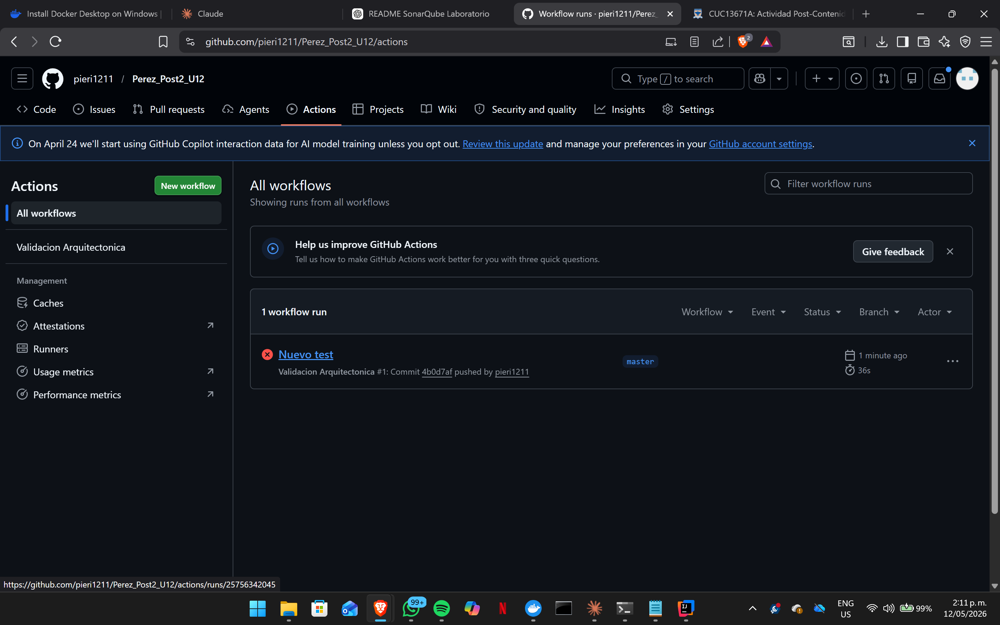

 prueba github

# Validación Arquitectónica con ArchUnit y ADR — Unidad 12 Post-Contenido 2

## 1. Descripción del proyecto

Este repositorio corresponde al laboratorio de la Unidad 12: Integración de Patrones y Arquitecturas, Post-Contenido 2. El objetivo principal fue extender el sistema de gestión de pedidos desarrollado en el Post-Contenido 1 mediante reglas de validación arquitectónica con ArchUnit, documentación de decisiones de diseño en formato ADR y automatización de la validación mediante GitHub Actions.

El laboratorio convierte las decisiones arquitectónicas del sistema en restricciones verificables dentro del código. De esta manera, la arquitectura no queda únicamente descrita en documentación, sino que también se valida automáticamente mediante pruebas ejecutables y un pipeline de integración continua.

---

## 2. Tecnologías utilizadas

- Java 17
- Spring Boot 3.x
- Maven
- JUnit 5
- ArchUnit 1.2.1
- GitHub Actions
- Git
- GitHub
- ADR Architecture Decision Records

---

## 3. Objetivo del laboratorio

El propósito del laboratorio fue implementar mecanismos de control arquitectónico sobre el sistema de pedidos, garantizando que las capas mantengan las dependencias permitidas y que las decisiones de diseño queden documentadas formalmente.

Para cumplir este objetivo se realizaron las siguientes actividades:

- Configuración de ArchUnit como dependencia de pruebas.
- Implementación de cinco reglas arquitectónicas.
- Ejecución local de las reglas mediante Maven.
- Configuración de un workflow de GitHub Actions.
- Documentación de tres decisiones arquitectónicas en formato ADR.
- Verificación de un pipeline exitoso y un pipeline fallido por violación intencional.
- Reversión de la violación para restablecer el estado correcto del proyecto.

---

## 4. Configuración de ArchUnit

Se agregó ArchUnit como dependencia de pruebas en el archivo `pom.xml`.

```xml
<dependency>
    <groupId>com.tngtech.archunit</groupId>
    <artifactId>archunit-junit5</artifactId>
    <version>1.2.1</version>
    <scope>test</scope>
</dependency>

Esta dependencia permite escribir reglas arquitectónicas como pruebas automatizadas. En lugar de validar manualmente la estructura del proyecto, ArchUnit inspecciona las clases compiladas y verifica si cumplen las restricciones definidas.

5. Validación arquitectónica

Se creó la clase ReglasArquitectura dentro del paquete de pruebas del proyecto. Esta clase contiene cinco reglas orientadas a proteger la arquitectura definida en el sistema de pedidos.

Ruta del archivo:

src/test/java/com/empresa/pedidos/ReglasArquitectura.java
6. Reglas ArchUnit implementadas
6.1 Regla 1: El dominio no debe depender de infraestructura ni adaptadores

Esta regla garantiza que las clases ubicadas en el paquete dominio no dependan de paquetes externos relacionados con infraestructura, adaptadores REST, persistencia, correo electrónico o frameworks específicos.

@ArchTest
static final ArchRule dominioAislado = noClasses()
        .that()
        .resideInAPackage("..dominio..")
        .should()
        .dependOnClassesThat()
        .resideInAnyPackage(
                "..infraestructura..",
                "..adaptadores..",
                "javax.persistence..",
                "org.springframework.mail.."
        );

La finalidad de esta restricción es proteger el núcleo del sistema. El dominio debe representar las reglas esenciales del negocio y no debe conocer detalles técnicos como JPA, controladores REST, correo electrónico o infraestructura concreta.

6.2 Regla 2: Los controladores solo deben acceder a la Facade

Esta regla establece que las clases del paquete adaptadores.rest solo deben acceder a la fachada, al dominio, a clases de Spring Web y a clases estándar de Java.

@ArchTest
static final ArchRule controladorSoloFacade = classes()
        .that()
        .resideInAPackage("..adaptadores.rest..")
        .should()
        .onlyAccessClassesThat()
        .resideInAnyPackage(
                "..adaptadores.facade..",
                "..dominio..",
                "org.springframework.web..",
                "java.."
        );

El objetivo es evitar que el controlador REST conozca directamente procesadores, repositorios, servicios de infraestructura o listeners. El controlador debe delegar la operación principal en la fachada, manteniendo una interfaz de entrada simple.

6.3 Regla 3: Los puertos de dominio deben ser interfaces

Esta regla valida que todas las clases ubicadas en dominio.puertos sean interfaces.

@ArchTest
static final ArchRule puertosComoInterfaces = classes()
        .that()
        .resideInAPackage("..dominio.puertos..")
        .should()
        .beInterfaces();

Esta regla conserva la separación entre contrato e implementación. Los puertos expresan lo que el dominio necesita, mientras que los adaptadores o la infraestructura implementan esos contratos.

6.4 Regla 4: Los procesadores deben implementar ProcesadorPedido

Esta regla garantiza que todas las clases ubicadas en adaptadores.procesadores implementen el puerto ProcesadorPedido.

@ArchTest
static final ArchRule procesadoresImplementanPuerto = classes()
        .that()
        .resideInAPackage("..adaptadores.procesadores..")
        .should()
        .implement(ProcesadorPedido.class);

Con esta validación, se asegura que cada procesador de pedido respete el contrato definido para el patrón Strategy. Esto permite que la Factory pueda seleccionar procesadores de manera uniforme.

6.5 Regla 5: La infraestructura no debe acceder a los adaptadores REST

Esta regla impide que las clases de infraestructura dependan de clases ubicadas en el paquete de controladores REST.

@ArchTest
static final ArchRule infraNoAccedeRest = noClasses()
        .that()
        .resideInAPackage("..infraestructura..")
        .should()
        .accessClassesThat()
        .resideInAPackage("..adaptadores.rest..");

La infraestructura puede implementar detalles técnicos, como persistencia o notificaciones, pero no debe conocer la capa de entrada HTTP. Esta restricción evita dependencias inversas incorrectas.

7. Clase completa de reglas arquitectónicas
package com.empresa.pedidos;

import com.empresa.pedidos.dominio.puertos.ProcesadorPedido;
import com.tngtech.archunit.junit.AnalyzeClasses;
import com.tngtech.archunit.junit.ArchTest;
import com.tngtech.archunit.lang.ArchRule;

import static com.tngtech.archunit.lang.syntax.ArchRuleDefinition.classes;
import static com.tngtech.archunit.lang.syntax.ArchRuleDefinition.noClasses;

@AnalyzeClasses(packages = "com.empresa.pedidos")
public class ReglasArquitectura {

    @ArchTest
    static final ArchRule dominioAislado = noClasses()
            .that()
            .resideInAPackage("..dominio..")
            .should()
            .dependOnClassesThat()
            .resideInAnyPackage(
                    "..infraestructura..",
                    "..adaptadores..",
                    "javax.persistence..",
                    "org.springframework.mail.."
            );

    @ArchTest
    static final ArchRule controladorSoloFacade = classes()
            .that()
            .resideInAPackage("..adaptadores.rest..")
            .should()
            .onlyAccessClassesThat()
            .resideInAnyPackage(
                    "..adaptadores.facade..",
                    "..dominio..",
                    "org.springframework.web..",
                    "java.."
            );

    @ArchTest
    static final ArchRule puertosComoInterfaces = classes()
            .that()
            .resideInAPackage("..dominio.puertos..")
            .should()
            .beInterfaces();

    @ArchTest
    static final ArchRule procesadoresImplementanPuerto = classes()
            .that()
            .resideInAPackage("..adaptadores.procesadores..")
            .should()
            .implement(ProcesadorPedido.class);

    @ArchTest
    static final ArchRule infraNoAccedeRest = noClasses()
            .that()
            .resideInAPackage("..infraestructura..")
            .should()
            .accessClassesThat()
            .resideInAPackage("..adaptadores.rest..");
}
8. Ejecución local de las reglas

Para ejecutar únicamente las pruebas de arquitectura se utilizó el siguiente comando:

mvn test -Dtest=ReglasArquitectura

La salida esperada fue:

Tests run: 5, Failures: 0, Errors: 0, Skipped: 0

También se ejecutó la verificación completa del proyecto:

mvn verify

Después de revertir la violación intencional, el proyecto compiló correctamente y todas las pruebas finalizaron sin errores.

9. Integración con GitHub Actions

Se creó un workflow de GitHub Actions para ejecutar automáticamente las pruebas de arquitectura en cada push hacia las ramas main y develop, así como en cada pull_request hacia main.

Ruta del archivo:

.github/workflows/arquitectura.yml

Contenido del workflow:

name: Validacion Arquitectonica

on:
  push:
    branches: [main, develop]
  pull_request:
    branches: [main]

jobs:
  arquitectura:
    runs-on: ubuntu-latest

    steps:
      - uses: actions/checkout@v4

      - name: Configurar Java 17
        uses: actions/setup-java@v4
        with:
          java-version: 17
          distribution: temurin

      - name: Cache Maven
        uses: actions/cache@v3
        with:
          path: ~/.m2
          key: ${{ runner.os }}-maven-${{ hashFiles('**/pom.xml') }}

      - name: Compilar y ejecutar pruebas de arquitectura
        run: mvn test -Dtest=ReglasArquitectura --no-transfer-progress

      - name: Ejecutar suite completa de pruebas
        run: mvn verify --no-transfer-progress

Este workflow asegura que cualquier cambio subido al repositorio sea validado automáticamente contra las reglas arquitectónicas definidas.

10. Verificación de pipeline rojo y pipeline verde

Para comprobar que las reglas no solo existen, sino que realmente detectan violaciones, se realizó una violación intencional de arquitectura. La prueba consistió en introducir una dependencia indebida desde una clase del dominio hacia una clase de infraestructura.

Procedimiento ejecutado:

git add .
git commit -m "test: violacion de arquitectura intencional"
git push origin develop

El pipeline de GitHub Actions falló correctamente, reportando una violación de las reglas de ArchUnit.

Posteriormente, la violación fue revertida:

git revert HEAD
git push origin develop

Después de revertir el cambio, el pipeline volvió a ejecutarse correctamente y quedó en estado verde.

11. Decisiones arquitectónicas documentadas

Se creó la carpeta docs/adr/ para registrar las decisiones de diseño más relevantes del sistema.

docs/
└── adr/
    ├── ADR-001.md
    ├── ADR-002.md
    └── ADR-003.md

Cada ADR contiene las cuatro secciones requeridas:

Estado
Contexto
Decisión
Consecuencias
12. ADR-001: Arquitectura Hexagonal para aislar el dominio
Estado

Aceptado.

Contexto

El sistema de pedidos debe soportar múltiples tipos de procesamiento y distintos canales de notificación. El acoplamiento directo del servicio a Spring Data JPA y a mecanismos concretos de notificación dificulta las pruebas unitarias, reduce la mantenibilidad y hace costoso cambiar implementaciones de infraestructura.

Decisión

Se adopta arquitectura hexagonal. El dominio define puertos mediante interfaces, y los adaptadores e infraestructura implementan dichos puertos. El dominio no debe importar clases de Spring, JPA, controladores REST ni servicios concretos de infraestructura.

Consecuencias

Consecuencias positivas:

El dominio puede probarse sin levantar el contenedor de Spring.
Es posible reemplazar una tecnología de persistencia sin modificar reglas de negocio.
Las dependencias se orientan hacia contratos y no hacia implementaciones concretas.

Consecuencias negativas:

Aumenta la cantidad de interfaces y clases.
Requiere mayor disciplina estructural para mantener correctamente los paquetes.
Puede resultar más complejo para integrantes nuevos del equipo.
13. ADR-002: Factory y Strategy para seleccionar procesadores
Estado

Aceptado.

Contexto

El sistema maneja varios tipos de pedido, como estándar, express e internacional. Cada tipo requiere un algoritmo distinto de procesamiento. Concentrar esa lógica en un switch o en condicionales dentro del servicio principal viola el principio Open/Closed, porque cada nuevo tipo de pedido obliga a modificar código existente.

Decisión

Se utiliza el patrón Strategy mediante la interfaz ProcesadorPedido, con una implementación por cada tipo de pedido. Además, se utiliza una Factory que recibe las estrategias disponibles y selecciona la implementación correcta en tiempo de ejecución.

Consecuencias

Consecuencias positivas:

Agregar un nuevo tipo de pedido exige crear una nueva clase, no modificar el servicio principal.
Cada procesador puede probarse de manera independiente.
Se reduce la complejidad condicional del flujo principal.

Consecuencias negativas:

Aumenta el número de clases del proyecto.
La selección mediante mapa puede no ser evidente para desarrolladores sin experiencia previa en Spring.
Es necesario garantizar que cada procesador esté correctamente registrado como componente.
14. ADR-003: Spring Events como mecanismo Observer para notificaciones
Estado

Aceptado.

Contexto

El sistema necesita notificar cuando un pedido es procesado. Los canales de notificación pueden incluir email, log y posibles canales futuros como SMS o mensajería externa. Si la fachada o el servicio principal dependen directamente de cada canal, el flujo central se vuelve frágil y difícil de extender.

Decisión

Se utiliza ApplicationEventPublisher de Spring para publicar el evento PedidoProcesadoEvent. Cada canal de notificación implementa un listener independiente mediante @EventListener.

Consecuencias

Consecuencias positivas:

Agregar un nuevo canal de notificación no requiere modificar FachadaPedidos.
Los listeners quedan desacoplados del flujo principal.
El evento puede ser consumido por múltiples receptores.

Consecuencias negativas:

El flujo de ejecución es menos visible que una llamada directa.
El orden de ejecución de listeners no está garantizado por defecto.
La depuración puede requerir revisar todos los listeners registrados para un evento.
15. Estructura final del repositorio
apellido-post2-u12/
│
├── .github/
│   └── workflows/
│       └── arquitectura.yml
│
├── docs/
│   └── adr/
│       ├── ADR-001.md
│       ├── ADR-002.md
│       └── ADR-003.md
│
├── src/
│   ├── main/
│   │   └── java/
│   │       └── com/
│   │           └── empresa/
│   │               └── pedidos/
│   │                   ├── dominio/
│   │                   ├── aplicacion/
│   │                   ├── infraestructura/
│   │                   └── adaptadores/
│   │
│   └── test/
│       └── java/
│           └── com/
│               └── empresa/
│                   └── pedidos/
│                       └── ReglasArquitectura.java
│
├── pom.xml
└── README.md
16. Commits realizados

El repositorio contiene commits descriptivos que reflejan el avance del laboratorio:

1. Implementar reglas arquitectónicas con ArchUnit
2. Documentar decisiones arquitectónicas en formato ADR
3. Configurar workflow de validación arquitectónica en GitHub Actions
4. Probar violación intencional y revertir arquitectura
17. Resultado final

El laboratorio permitió transformar las decisiones arquitectónicas del sistema en reglas verificables mediante ArchUnit. Las cinco reglas implementadas protegen el aislamiento del dominio, restringen el acceso de los controladores a la fachada, obligan a que los puertos sean interfaces, garantizan que los procesadores implementen el contrato correspondiente y evitan dependencias indebidas desde infraestructura hacia REST.

La integración con GitHub Actions permite que estas reglas se ejecuten automáticamente en cada cambio subido al repositorio. Además, los ADR documentan las decisiones más importantes del diseño, incluyendo su contexto, justificación y consecuencias. Como resultado, el proyecto queda respaldado por documentación técnica y validación automatizada, lo cual mejora la mantenibilidad y reduce el riesgo de degradación arquitectónica.